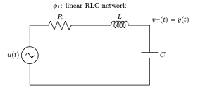

# Dynamic Phasor and Time-Domain Circuit Simulation

last reviewed at 26 November, 2025

This folder collects small studies on how a benchmark RLC network can be
modeled and simulated using **dynamic phasors** and **matrix differential
equations**.  The same base circuit is analysed in two different operating
scenarios:

- **Report 1 – ϕ₁: Linear RLC Network (No Switching)**  
  The RLC network is treated as a purely linear circuit.  
  Modified Nodal Analysis (MNA) is used to derive matrix differential
  equations, and the time-domain response is obtained with a trapezoidal
  integrator.  Classical phasor and dynamic phasor representations are
  discussed under the assumption of slowly varying, almost-sinusoidal
  waveforms.

- **Report 2 – ϕ₂: RLC Network with Switching / Diode**  
  The same network is extended with a switching element (e.g. a diode or an
  ideal switch), so that the topology changes in time.  
  The MNA formulation is updated for the different switching states and
  time-domain simulations are used to study the resulting non-sinusoidal
  waveforms.  The limitations of dynamic phasor descriptions in the presence
  of strong switching and non-linearities are highlighted, and the relation
  to EMT/PSCAD-type simulations is discussed.

---

## 1. Background

### 1.1 Steady-State Phasor

For a sinusoidal signal with constant amplitude and phase

$$
x(t) = \hat{X} \cos(\omega_0 t + \phi),
$$

the steady-state phasor is the complex constant

$$
X = \hat{X} e^{j\phi}.
$$

Using this definition, the time-domain signal can be written as the real part
of a rotating phasor:

$$
x(t) = \Re\{ X e^{j\omega_0 t} \}.
$$

In this classical setting, both the magnitude $|X| = \hat{X}$ and the
angle $\arg(X) = \phi$ are **independent of time**.

---

### 1.2 Dynamic Phasors

To describe **slowly time-varying** signals, the concept of the dynamic phasor
extends the idea of a phasor.

The **classical dynamic phasor** of harmonic index \(k\) is defined as a
period-averaged Fourier coefficient over one fundamental period \(T_0\):

$$
X_k(t) = \frac{1}{T_0} \int_{t-T_0}^{t} x(\tau)\, e^{-j k \omega_0 \tau}\, d\tau ,
\qquad T_0 = \frac{2\pi}{\omega_0}.
$$

The original signal can then be approximated as

$$
x(t) \approx \sum_{k=-K}^{K} X_k(t)\, e^{j k \omega_0 t},
$$

where the coefficients $X_k(t)$ change **slowly** with time and capture the
envelope of each harmonic.

The **instantaneous dynamic phasor** removes the explicit time-window
averaging and instead defines a phasor $\bar{X}(t)$ such that, for a
real-valued signal $x(t)$,

$$
x(t) = \Re\{\bar{X}(t)\, e^{j\theta(t)}\}
$$

where $\theta(t)$ is a prescribed reference angle (for example
$\theta(t) = \omega_0 t$ or a more general time-varying phase).  
This representation is defined at every instant without integrating over a
past period.

Report 1 uses a scalar test signal to compare:

- the magnitude and phase of the **instantaneous** phasor, and  
- the magnitude and phase of the **classical (period-averaged)** phasor,

and shows how the classical definition behaves like a **low-pass filtered**
version of the instantaneous phasor.

---

### 1.3 Series RLC Circuit and MNA

For a series RLC circuit driven by an input voltage $u(t)$, the element
relations are

$$
v_R(t) = R\, i_L(t), \qquad
v_L(t) = L\, \frac{di_L(t)}{dt}, \qquad
i_C(t) = C\, \frac{dv_C(t)}{dt}.
$$

In the Laplace domain, the impedances are

$$
Z_R = R, \qquad
Z_L = sL, \qquad
Z_C = \frac{1}{sC},
$$

and the transfer function (gain) from input voltage to capacitor voltage is

$$
G(s) = \frac{V_C(s)}{U(s)} =
\frac{1}{LC s^2 + RC s + 1}.
$$

In the time domain, this leads to the second-order differential equation

$$
LC\, \frac{d^2 v_C(t)}{dt^2} + RC\, \frac{dv_C(t)}{dt} + v_C(t) = u(t).
$$

By defining the state vector

$$
\mathbf{x}(t) =
\begin{bmatrix}
i_L(t) \\
v_C(t)
\end{bmatrix},
$$

the dynamics can be written in standard state-space (matrix differential
equation) form:

$$
\dot{\mathbf{x}}(t) = A \mathbf{x}(t) + B u(t), \qquad
y(t) = C \mathbf{x}(t),
$$

with

$$
A =
\begin{bmatrix}
-\dfrac{R}{L} & -\dfrac{1}{L} \\
\dfrac{1}{C}  & 0
\end{bmatrix},
\qquad
B =
\begin{bmatrix}
\dfrac{1}{L} \\
0
\end{bmatrix},
\qquad
C = \begin{bmatrix} 0 & 1 \end{bmatrix}.
$$

In **Modified Nodal Analysis (MNA)**, more general circuits are written in the
compact matrix form

$$
G\, \mathbf{v}(t) + C\, \frac{d\mathbf{v}(t)}{dt} = \mathbf{i}_\text{source}(t),
$$

where $\mathbf{v}(t)$ collects node voltages and selected branch currents.
Report 2 derives such equations for an RLC circuit (with and without
switching elements) and integrates them in time using a trapezoidal rule,
similar to how industrial tools such as EMT-type and PSCAD-type simulators
operate.

### 1.4 Benchmark circuits ϕ₁ and ϕ₂

The same base RLC network is used in two operating scenarios.

**ϕ₁ – Linear RLC network**



Input is the source voltage \(u(t)\); output is the capacitor voltage
\(y(t) = v_C(t)\).

**ϕ₂ – RLC network with switch / diode**


In ϕ₂ an additional switching element \(S(t)\) (or a diode) is inserted in the
RLC path. The input is still \(u(t)\) and the output is the same node
voltage \(y(t) = v_C(t)\), but the topology changes when the switch
turns on or off, leading to strongly time-varying, non-sinusoidal
waveforms.


---

## 2. Repository Structure

- `report_phi1_linear_rlc.pdf`  
  – Report 1 (ϕ₁): linear RLC network, MNA formulation, time-domain
    simulation and dynamic phasor interpretation under slowly varying,
    near-sinusoidal conditions.

- `report_phi2_rlc_with_switch.pdf`  
  – Report 2 (ϕ₂): same RLC network with a switching element or diode,
    topology changes in time, non-sinusoidal waveforms, and a discussion of
    the limitations of dynamic phasors compared with EMT/PSCAD-style
    time-domain simulation.

- `notebooks/`  
  – Jupyter notebooks used to generate the figures and numerical results.

- `python/`  
  – Stand-alone Python scripts for the simulations (RLC step response,
    sinusoidal excitation, three-phase examples, dynamic phasor plots).

---

## 3. Running the Simulations

Most examples are implemented in Python using NumPy and Matplotlib.

1. Create and activate a virtual environment (optional but recommended).
2. Install dependencies:

   ```bash
   pip install numpy matplotlib
    ```

3. Run a script, for example:

    ```bash
    python python/rlc_step_response.py
    ```

## 3. References

The work in this folder is mainly based on:

- F. N. Najm, Circuit Simulation. Hoboken, NJ, USA: John Wiley & Sons, 2010.

- C. K. Alexander and M. N. O. Sadiku, Fundamentals of Electric Circuits, 5th ed. New York, NY, USA: McGraw–Hill, 2013.

- S. R. Sanders, J. M. Noworolski, X. Z. Liu, and G. C. Verghese, “Generalized averaging method for power conversion circuits,” IEEE Trans. Power Electron., vol. 6, no. 2, pp. 251–259, Apr. 1991.

- C. T. Rim, S. A. A. Shah, H. Park, et al., “General Instantaneous Dynamic Phasor,” IEEE Trans. Power Electron., vol. 40, no. 11, pp. 16953–16962, Nov. 2025.