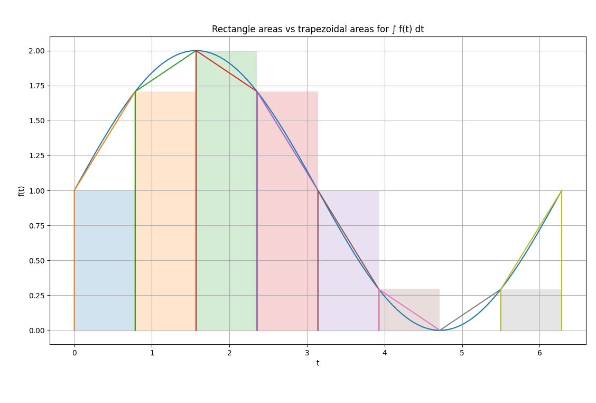
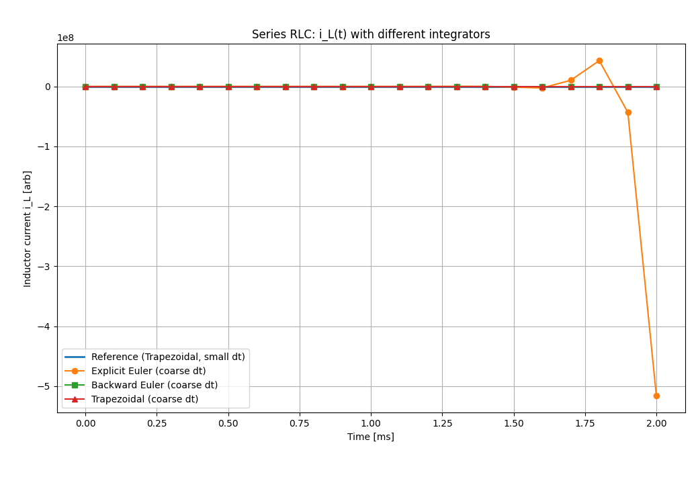

# Trapezoidal Integrator Demos

This folder contains small Python demos that visualise **why** the trapezoidal
integrator is useful for circuit simulation and how it differs from simpler
methods like the rectangle rule or explicit Euler.

---

## Folder structure

- `compare_integrators.py`  
  ODE example: compares Explicit Euler, Backward Euler, and Trapezoidal for  
  ($x' = -x $), ($x(0) = 1 $).

- `rlc_integrator_comparison.py`  
  Series RLC circuit example: compares the same integrators for an LC oscillation.

- `trapezoidal_area_demo.py`  
  Pure integration example: rectangle vs trapezoidal rule on a smooth function.

- `figs/`  
  Pre-generated figures used in the README:
  - `euler_rectangle.png`
  - `exactArea_comparison.png`
  - `i_Lt_integrators.png`
  - `integration_comparison1.png
  - `rect_vs_trapezoid_area.png`
  - `v_Ct_integrators.png`

---

## 1. Numerical integration: rectangles vs trapezoids

### 1.1. The problem

Given a smooth function ($f(t)$), we want to approximate the integral

$$
\int_{t_0}^{t_N} f(t)\,dt
$$

using only a finite number of samples.

We split the interval into ($N$) steps of size ($h$):

$$
t_n = t_0 + n h,\quad n=0,\ldots, N,\quad h = \frac{t_N - t_0}{N}.
$$

### 1.2. Rectangle rule (left Riemann sum)

For each sub-interval ($[t_n, t_{n+1}]$), we approximate the area by a **rectangle**
using the left endpoint:

$$
\int_{t_n}^{t_{n+1}} f(t)\,dt
\;\approx\;
h\, f(t_n).
$$

Summing up all rectangles:

$$
I_{\text{rect}} \approx
\sum_{n=0}^{N-1} h\,f(t_n).
$$

This is what explicit Euler implicitly does when integrating ODEs:
it uses the slope at the left endpoint only.

**Geometric picture of the rectangle rule:**

### 1.3. Trapezoidal rule

The trapezoidal rule uses a **trapezoid** instead of a rectangle in each interval:

$$
\int_{t_n}^{t_{n+1}} f(t)\,dt
\;\approx\;
\frac{h}{2}\big[f(t_n) + f(t_{n+1})\big].
$$

Total integral:

$$
I_{\text{trap}} \approx
\sum_{n=0}^{N-1}
\frac{h}{2}\big[f(t_n) + f(t_{n+1})\big].
$$

This is more accurate because it uses both endpoints and therefore follows
the curve shape better.

**Rectangle vs trapezoidal areas on a smooth function:**

### 1.4. Cumulative integral comparison

When we build the cumulative integral

$$
F(t) = \int_{t_0}^{t} f(s)\,ds,
$$

we can compare:

- exact ( $F(t)$),
- rectangle approximation,
- trapezoidal approximation.

You should see the trapezoidal curve almost lying on top of the exact curve,
while the rectangle curve visibly deviates.

---

## 2. ODE example: ($ x' = -x $)

To see how this feeds into **ODE time stepping**, consider:

$$
x'(t) = -x(t), \qquad x(0) = 1.
$$

The exact solution is:

$$
x(t) = e^{-t}.
$$

We integrate from ($t=0$) to ($t=5$) with a relatively coarse step ($h = 0.5$).

### 2.1. Explicit Euler

Explicit Euler uses the rectangle rule on the derivative:

$$
x_{n+1} = x_n + h\, f(t_n, x_n)
        = x_n + h(-x_n)
        = (1 - h)\,x_n.
$$

With \(h=0.5\), this becomes:

$$
x_{n+1} = 0.5\,x_n.
$$

It is stable here, but **decays too quickly** compared to the exact exponential.

### 2.2. Backward Euler

Backward Euler is an implicit method:

$$
x_{n+1} = x_n + h\, f(t_{n+1}, x_{n+1})
        = x_n - h\,x_{n+1}.
$$

Solving for ($x_{n+1}$):

$$
x_{n+1} = \frac{x_n}{1 + h}.
$$

With \(h=0.5\), this gives:

$$
x_{n+1} = \frac{2}{3} x_n,
$$

which decays **too slowly** (numerical damping).

### 2.3. Trapezoidal integrator (Crank–Nicolson)

Trapezoidal uses the **average** slope over the step:

$$
x_{n+1}
= x_n + \frac{h}{2}\big[f(t_n,x_n) + f(t_{n+1}, x_{n+1})\big].
$$

For ($x'=-x$):

$$
x_{n+1}
= x_n - \frac{h}{2}(x_n + x_{n+1}).
$$

Rearranging:

$$
\left(1 + \frac{h}{2}\right)x_{n+1}
= \left(1 - \frac{h}{2}\right)x_n
\quad\Rightarrow\quad
x_{n+1}
= \frac{1 - h/2}{1 + h/2} x_n.
$$

This factor is much closer to the true decay \(e^{-h}\) and gives a very good
approximation even for coarse \(h\).

**Comparison of the three methods to the exact solution:**

- Blue: exact solution ($x(t) = e^{-t}$)
- Dots: Explicit Euler (decays too fast)
- Squares: Backward Euler (decays too slowly)
- Triangles: Trapezoidal (almost on top of exact)

---

## 3. Series RLC circuit example

Now we apply the same ideas to a simple **series RLC** circuit with no source
and initial energy in the capacitor.

State vector:

$$
\mathbf{x} =
\begin{bmatrix}
i_L \\ v_C
\end{bmatrix}.
$$

Dynamics:

$$
L \frac{di_L}{dt} + R i_L + v_C = 0, \qquad
C \frac{dv_C}{dt} - i_L = 0.
$$

This can be written in matrix form:

$$
\frac{d}{dt} \begin{bmatrix} i_L \\ v_C \end{bmatrix}=A\begin{bmatrix}i_L \\ v_C\end{bmatrix}, \qquad =\begin{bmatrix}- R/L & -1/L \\1/C   &  0\end{bmatrix}.
$$

We simulate with:

- initial condition: ($i_L(0) = 0 $), ($v_C(0) = 1$) (charged capacitor),
- a relatively coarse time step ($\Delta t$),
- different integrators.

For a linear system ($x' = A x$), the step matrices are:

- Explicit Euler:  
  
$$
x_{n+1} = (I + hA) x_n.
$$

- Backward Euler:  
  
$$
x_{n+1} = (I - hA)^{-1} x_n.
$$

- Trapezoidal:  
  
$$
x_{n+1} = (I - \tfrac{h}{2}A)^{-1} (I + \tfrac{h}{2}A) x_n.
$$

The reference solution is obtained with a **much smaller** time step using
trapezoidal (essentially “ground truth” EMT).

### 3.1. Capacitor voltage

- Reference (fine dt, trapezoidal): smooth oscillation with moderate damping.
- Explicit Euler: may distort the oscillation and can become unstable for stiffer cases.
- Backward Euler: oscillation is strongly damped (energy disappears too quickly).
- Trapezoidal (coarse dt): follows the reference closely, preserving the oscillatory shape.

### 3.2. Inductor current

The same conclusions hold for the inductor current: trapezoidal with a relatively
large step still tracks the reference well, while explicit Euler and backward Euler
show significant numerical distortion.

---

## 4. Connection to MNA and EMT

In Modified Nodal Analysis (MNA) for circuits, we often write

$$
\mathbf{C} \dot{\mathbf{x}}(t) + \mathbf{G}\,\mathbf{x}(t) = \mathbf{b}(t),
$$

where:

- ( $\mathbf{x}(t)$) = vector of node voltages and some branch currents,
- ( $\mathbf{C}$) = capacitance/inductance-related terms,
- ( $\mathbf{G}$) = conductances and static elements,
- ( $\mathbf{b}(t)$) = sources.

Applying the trapezoidal integrator with step ($h$) gives, at each time step:

$$
\mathbf{C} \frac{\mathbf{x}_{n+1} - \mathbf{x}_n}{h}+\frac{1}{2} \mathbf{G} (\mathbf{x}_{n+1} + \mathbf{x}_n)=\frac{1}{2}(\mathbf{b}_{n+1} + \mathbf{b}_n).
$$

Rearranging:

$$
\underbrace{\left(\frac{\mathbf{C}}{h} + \frac{1}{2}\mathbf{G}\right)}_{\mathbf{A}}\mathbf{x}_{n+1}=\underbrace{\left(\frac{\mathbf{C}}{h} - \frac{1}{2}\mathbf{G}\right)\mathbf{x}_n + \frac{1}{2}(\mathbf{b}_{n+1} + \mathbf{b}_n)}_{\mathbf{z}}.
$$

So every time step is just solving a linear system

$$
\mathbf{A}\,\mathbf{x}_{n+1} = \mathbf{z},
$$

which is exactly what SPICE-like EMT solvers do internally.

The trapezoidal method is popular in circuit simulation because it is:

- **A-stable** (good stability even for stiff circuits),
- **second-order accurate** in time,
- and introduces **less numerical damping** than backward Euler,
  which is crucial for preserving RLC oscillations.

---
